# Solid Prensiplerinin Uygulandığı Demo Proje

**Bu proje, Akbank bootcamp derslerinde üzerinde durulan "SOLID" prensiplerinin bir örnek üzerinde
uygulanmasıdır.**

**"Single Responsibility", "Open Closed", ve "Dependency Inversion" prensiplerinin uygulandığı örnek
bir proje oluşturalım.**

Proje içerisinde, 4 adet varlık sınıfı olsun, ve wep api aracılığıyla bu sınıflar üzerinde bazı işlemler gerçekleştirilsin. Varlıklardan üçü Person sınıfından miras alsın, tüm bu sınıflarda ortak olan ve olmayan servis methotları bulunsun. Öncelikle, projede iş dağılımı yapabilmek, projenin yönetilebilirliğini kolaylaştırmak ve projeyi sürdürülebilir kılmak amacıyla katmanlı mimari kullanarak katmanlarımızı oluşturalım.

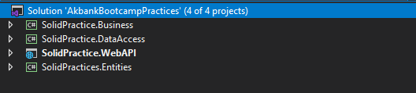

Entities katmanında varlık sınıflarımızı oluşturalım, ve aralarındaki ilişkileri oluşturalım.

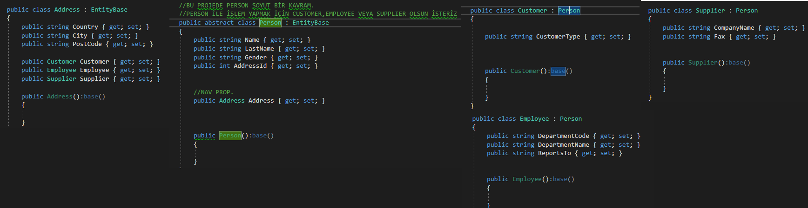

Dbcontext sınıfımızı oluşturalım, ve migration ile veri tabanını oluşturalım.

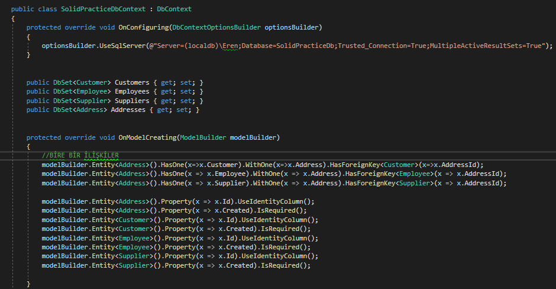

Şimdi, Data Access katmanını kodlayalım. 

**Single Responsibility Principle: Her nesne, sadece bir işi yapmalı. Birden fazla şeyi yapabiliyor olması, yapması gerektiği anlamına gelmez.**

Bu prensip gereği, her bir tabloya özel bir veri tabanı işlemlerini gerçekleştiren sınıf yazmak daha doğru olacaktır. 

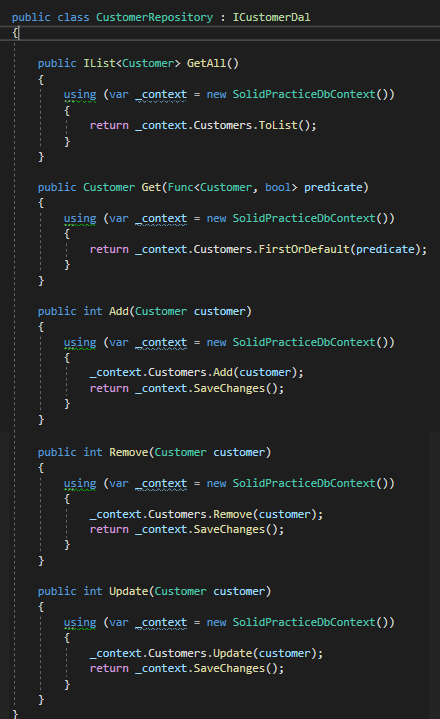

Addresses, Employees ve Suppliers tabloları için de aynı şekilde veri tabanı işlemleri yapan sınıflar oluşturulmuştur.

Şimdi, Business katmanımızı kodlamaya başlayalım. ilk aşamada tüm tablolar için listeleme ve ekleme
işlemleri kullanılabilir olsun, sonrasında open closed prensibine göre silme ve güncelleme işlemleri getirelim.

Öncelikle, Customer, Employee ve Supplier aynı sınıftan (Person) miras alıyor. Haliyle bu sınıflara özel servis sınıflarında ortak operasyonlar bulunabilir. 

Tüm bu ortak methotları servislere tekrar tekrar yazmaktansa, person servislerinin miras aldığı base bir personservice yazabililiriz.

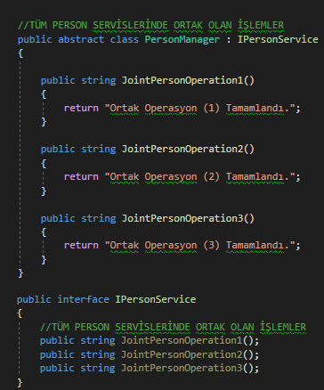

Diğer tüm person servislerinin implemente ettiği interface'ler, IPersonService interface'ini miras alabilir.
Böylece, bu interface'leri implemente eden sınıflar, IPersonService'i de implemente etmek zorunda kalır. 
Kilit nokta ise, tüm bu interface'ler üzerinden, IPersonService methotlarına erişilebilir.

**Dependency Inversion Principle : Üst hiyerşideki bir sınıf, alt hiyerarşide bulunan bir sınıfı new'leyemez. Sınıflar arasında gevşek bağımlılık bulunmalıdır.**

Bu prensibi uygulamadaki en büyük yardımcımız, Dependency Injection tasarım deseni ve IoC Container yapısıdır.
İkisi birbirini ayağa kaldıran yapılardır, ve bağımlılıkları büyük ölçüde azaltmada kullanılır.

Constructor injection ile, dal interface'lerimiz içerisine referans ataması yaparak servis methotlarında kullandık.

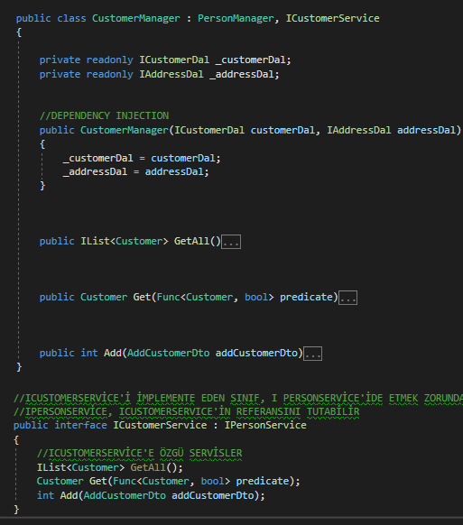

**Yapılan implementasyon sonrası, CustomerManager sınıfı, tüm person servislerinde ortak olan operasyonlara
miras yoluyla doğrudan sahip oldu. Bir diğer nokta ise, artık ICustomerService interface'i üzerinden, bu ortak operasyonlara erişilebilmektedir. New'leme zorunluluğu ortadan kalktı.**

Diğer tüm person servis sınıfları, bu şekilde oluşturuldu.

Controller tarafında ise, sadece servis interface'lerini injection yaparak kullanmak kaldı. Veritabanına bir adres ekleme işlemi gerçekleştirelim.

Şimdi, bu adrese sahip bir müşteri, personel ve tedarikçi ekleyelim.

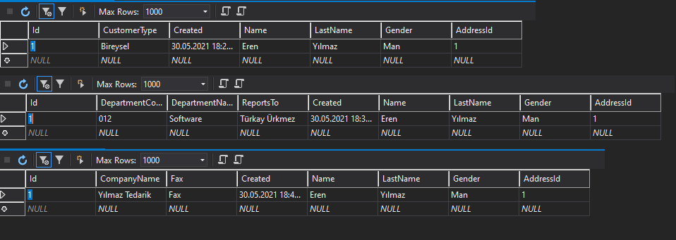

Görüldüğü üzere, servislerimiz sorunsuz çalışıyor. Buradaki önemli nokta, başka 1 numaralı adrese sahip
müşteri, personel veya tedarikçi tanımlanamayacağıdır. Çünkü bu tablolar ile adres tablosundaki arasındaki ilişki 1-1 ilişki olarak belirtilmiştir.

Bir diğer nokta ise, tüm person servislerinde ortak olan operasyonlara, controllerda interface üzerinden doğrudan erişebilir olduğumuz. 

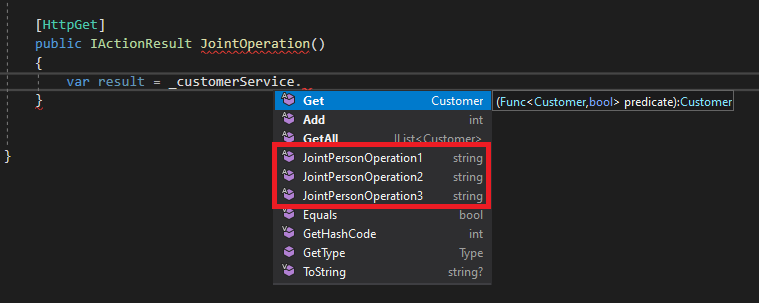

Son adım olarak, sisteme artık veri silme servisinin eklenmesi senaryosunu uygulayalım.

**Open Closed Principle : Bir nesne gelişime açık, ancak değişime kapalı olmalıdır. Yeni bir özellik eklerlen mevcuttaki koda dokunulmaz.**

Sisteme kayıt silme servisini ekleyelim, ve neler oluyor görelim.

Controllerda injection yöntemiyle kullandığımız ICustomerService interface'i içerisine, ilgili methotu ekliyoruz.

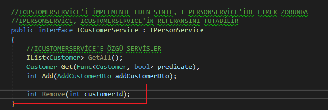

Görüldüğü üzere, CustomerManager içerisinde hiç bir methot değiştirilmedi. Sadece yeni methot eklendi.

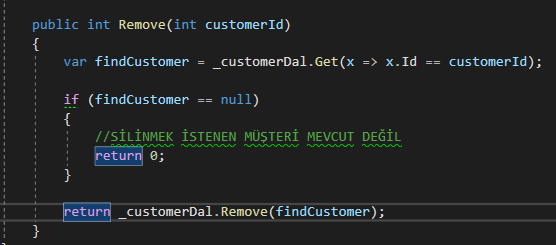

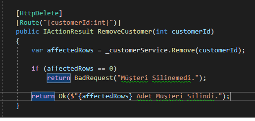

Böylece tüm prensipleri uyguladığımız demo projemizi tamamlamış olduk.

İlerleyen aşamada, Entity Framework dışında sisteme dapper üzerinde çalışan yapı ekleyeceğiz.
Dependency Injection desenini kullanarak oluştrduğumuz bu modüler yapının, Sistemi Entity Framework üzerinden Dapper'a geçirirken ne kadar kolaylık sağlayacağını göreceğiz.

